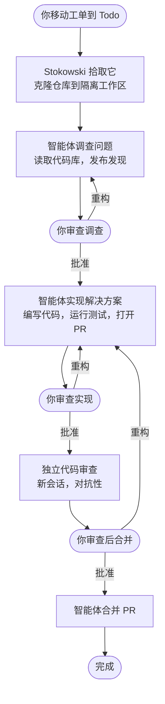
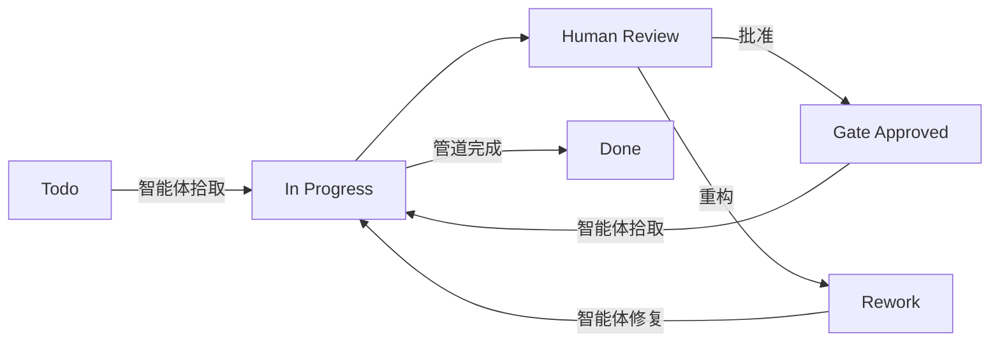

# Stokowski

**由 Linear issues 编排的自主编程智能体。**

[OpenAI Symphony](https://github.com/openai/symphony) 工作流规范的 Python 实现 — 适配了 [Claude Code](https://claude.ai/claude-code)、[Codex](https://openai.com/index/introducing-codex/) 和 [Linear](https://linear.app)。

[](https://www.python.org/downloads/)
[](LICENSE)
[](https://claude.ai/claude-code)
[](https://linear.app)
[](https://github.com/openai/symphony)

*以 Leopold Stokowski 命名 — 那位将交响乐带给大众的指挥家。*

---

## 目录

- [它实际上做什么](#它实际上做什么)
- [这与 Emdash 有什么不同](#这与-emdash-有什么不同)
- [它是什么](#它是什么)
- [特性](#特性)
- [Stokowski 超越 Symphony 的改进](#stokowski-超越-symphony-的改进)
- [设置指南](#设置指南)
  - [1. 安装前置条件](#1-安装前置条件)
  - [2. 安装 Stokowski](#2-安装-stokowski)
  - [3. 获取你的 Linear API 密钥](#3-获取你的-linear-api-密钥)
  - [4. 配置你的环境](#4-配置你的环境)
  - [5. 设置 Linear 工作流状态](#5-设置-linear-工作流状态)
  - [6. 配置你的工作流](#6-配置你的工作流)
  - [7. 验证](#7-验证)
  - [8. 运行](#8-运行)
- [配置参考](#配置参考)
- [提示模板变量](#提示模板变量)
- [MCP 服务器](#mcp-服务器)
- [为智能体编写好的工单](#为智能体编写好的工单)
- [充分利用 Stokowski](#充分利用-stokowski)
- [架构](#架构)
- [升级](#升级)
- [安全](#安全)
- [许可证](#许可证)
- [致谢](#致谢)

---

## 它实际上做什么

你在 Linear 中写一个工单。把它移动到 **Todo**。就这些 — Stokowski 处理其余一切：



每个智能体在独立的 git 克隆中运行 — 可以并行处理多个工单而不会冲突。Token 使用量、轮次计数和最后活动在终端和 Web 仪表板中实时跟踪。

---

## 这与 Emdash 有什么不同

[Emdash](https://www.emdash.sh/) 是一个解决类似问题的出色产品 — 它与 Linear 集成，为你的工单启动 Claude Code 智能体。如果你正在评估两者，这里有一个诚实的比较。

**核心区别：将智能体上下文与交互上下文分离。**

当你在仓库中与 Claude Code 交互工作时，你依赖 `CLAUDE.md` 和项目的规则文件来指导 Claude 的行为。将自主智能体指令放在 `CLAUDE.md` 中的问题是它们会渗透到你的常规 Claude Code 会话中 — 你日常的交互工作现在带着所有"你正在无头运行，永远不要问人类，遵循这个状态机"的指令，这些指令只对无人值守的智能体有意义。

Stokowski 用 `workflow.yaml` 和 `prompts/` 目录解决这个问题。你的自主智能体提示 — 如何处理 Linear 状态、要运行什么质量门、如何组织 PR、被阻塞时做什么 — 完全存在于你的工作流配置中，并且只注入到无头智能体会话中。你的 `CLAUDE.md` 保持干净用于交互使用。

```
交互会话:    Claude 读取 CLAUDE.md              ← 你的常规指令
Stokowski 智能体: Claude 读取 CLAUDE.md               ← 相同约定
                      +  workflow.yaml 配置        ← 状态机 + 调度
                      +  prompts/ 阶段文件        ← 仅智能体指令
```

这种分离让你可以构建真正的自主管道，而不影响你的日常开发者体验。

**其他区别：**

| | Stokowski | Emdash |
|---|---|---|
| 智能体运行器 | Claude Code + Codex — 在同一管道中按状态混合提供商 | 仅 Claude Code |
| 智能体指令 | 独立的 `workflow.yaml` + `prompts/` — 不影响交互会话 | 通过项目规则应用，与交互上下文共享 |
| 提示模板 | 三层 Jinja2 提示组装，包含完整问题上下文 | 由 Emdash 管理 |
| 质量门钩子 | 每轮 `before_run` / `after_run` shell 脚本 | 不可用 |
| MCP 服务器 | 仓库中的任何 `.mcp.json` — Figma、iOS Simulator、Playwright 等 | Emdash 管理的集成 |
| 按状态并发 | 可按 Linear 状态配置 | 不可用 |
| 成本 | 你现有的 Claude / OpenAI 订阅 | 额外的 Emdash 订阅 |
| 开源 | 是 — 分支、修改、自托管 | 闭源 SaaS |
| 维护 | 你维护它 | Emdash 维护它 |

**何时选择 Emdash：** 你想要一个完善的托管产品，不想运行基础设施，且你的工作流符合他们的模型。

**何时选择 Stokowski：** 你想要完全控制智能体提示和工作流，需要交互/自主上下文分离，想要在同一管道中混合 Claude Code 和 Codex，有专业 MCP 工具（Figma、iOS 等），或者想在每轮运行质量门。

---

## 它是什么

[Symphony](https://github.com/openai/symphony) 是 OpenAI 自主编程智能体编排的开放规范：轮询 tracker 获取 issues、创建隔离工作区、运行智能体、管理多轮会话、重试失败、协调状态。它附带 Codex/Elixir 参考实现。

**Stokowski 实现相同规范，支持多运行器。** 指向你的 Linear 项目和 git 仓库，智能体自主拾取 issues、编写代码、运行测试、打开 PR、移动工单通过你的工作流 — 同时你做其他事情。

同一管道中的不同状态可以使用不同的运行器和模型。在调查中使用 Claude Code Opus，在实现中使用 Sonnet，在代码审查中使用 Codex 获取第二种意见 — 全部在同一次运行中，通过 `workflow.yaml` 按状态配置。

```
Linear issue → 隔离 git 克隆 → 智能体（Claude 或 Codex）→ PR + 人工审查 → 合并
```

### 它如何映射到 Symphony

| Symphony | Stokowski |
|----------|-----------|
| `codex app-server` JSON-RPC | `claude -p --output-format stream-json` 或 `codex --quiet` |
| `thread/start` → thread_id | 首轮 → `session_id` |
| `turn/start` on thread | `claude -p --resume <session_id>` |
| `approval_policy: never` | `--dangerously-skip-permissions` |
| `thread_sandbox` 工具 | `--allowedTools` 列表 |
| Elixir/OTP 监督 | Python asyncio 任务池 |

---

## 特性

- **可配置状态机** — 在 `workflow.yaml` 中定义智能体阶段、人工门和转换；issues 自动流经你的管道
- **多运行器** — 同一管道中支持 Claude Code 和 Codex；不同状态可以使用不同的运行器和模型（例如 Opus 用于调查、Sonnet 用于实现、Codex 用于审查）
- **三层提示组装** — 全局提示 + 每阶段提示 + 自动注入的生命周期上下文；每层都是包含完整 issue 变量的 Jinja2 模板
- **Linear 驱动调度** — 轮询配置状态中的 issues，以有限并发调度智能体
- **会话连续性** — 通过 `--resume`（Claude Code）进行多轮智能体会话；智能体从上次离开的地方继续
- **隔离工作区** — 每个 issue 的 git 克隆，因此并行智能体永远不会冲突
- **生命周期钩子** — `after_create`、`before_run`、`after_run`、`before_remove`、`on_stage_enter` shell 脚本用于设置、质量门和清理
- **带退避的重试** — 失败的轮次自动重试，使用指数退避
- **状态协调** — 如果运行中的智能体的 Linear issue 在运行中移动到终止状态，则停止该智能体
- **Web 仪表板** — 在 `localhost:<port>` 实时查看智能体状态、token 使用量和最后活动
- **MCP 感知** — 智能体从工作区继承 `.mcp.json`（Figma、Linear、iOS Simulator、Playwright 等）
- **持久终端 UI** — 实时状态栏、单键控制（`q` 退出 · `s` 状态 · `r` 刷新 · `h` 帮助）

---

## Stokowski 超越 Symphony 的改进

除了移植到 Claude Code + Python，Stokowski 还包含参考实现的几个改进：

<details>
<summary><strong>终端体验</strong></summary>

- **持久命令栏** — 固定在终端底部的实时页脚，显示智能体数量、token 使用量和键盘快捷键；日志滚动时保持可见
- **单键控制** — `q` 优雅关闭 · `s` 状态表 · `r` 强制轮询 · `h` 帮助。无需 Ctrl+C。
- **优雅关闭** — `q` 在退出前通过进程组杀死所有 Claude Code 子进程，所以你不会在孤立智能体上浪费 token
- **更新检查** — 启动时，将本地克隆与 `origin/main` 比较，当有新提交可用时在页脚显示更新指示器

</details>

<details>
<summary><strong>Web 仪表板</strong></summary>

- 使用 FastAPI + 纯 JS 构建的实时仪表板（无页面刷新）
- 智能体卡片：轮次计数、token 使用量、最后活动消息、闪烁的实时状态标签
- 聚合指标：总 token 使用量、运行时间、运行/排队计数
- 每 3 秒自动刷新

</details>

<details>
<summary><strong>可靠性</strong></summary>

- **卡住检测** — 杀死在可配置时间段内无输出的智能体，而不是等待完整轮次超时
- **进程组跟踪** — 生成时注册的子 PID，通过 `os.killpg` 杀死，捕获孙进程
- **可中断轮询睡眠** — 关闭立即唤醒轮询循环；不等待当前间隔到期
- **无头系统提示** — 智能体收到追加的系统提示，禁用交互式技能、计划模式和斜杠命令

</details>

<details>
<summary><strong>配置</strong></summary>

- **`.env` 自动加载** — 启动时从 `.env` 加载 `LINEAR_API_KEY`，无需 `export`
- **`$VAR` 引用** — 任何配置值都可以使用 `$VAR_NAME` 语法引用环境变量
- **热重载** — `workflow.yaml` 在每次轮询时重新解析；配置更改无需重启即可生效
- **按状态并发限制** — 独立于全局限制，按 Linear 状态限制并发

</details>

---

## 设置指南

> **按顺序执行这些步骤。** 每一步都是 Stokowski 工作的必要条件。

### 1. 安装前置条件

<details>
<summary><strong>Python 3.11+</strong></summary>

```bash
python3 --version  # 必须是 3.11 或更高
```

如果未安装：[python.org/downloads](https://www.python.org/downloads/) 或在 macOS 上 `brew install python`。

</details>

<details>
<summary><strong>Claude Code</strong></summary>

```bash
npm install -g @anthropic-ai/claude-code

# 验证并认证
claude --version
claude  # 如果尚未认证，按照登录提示操作
```

</details>

<details>
<summary><strong>GitHub CLI — 智能体打开 PR 所需</strong></summary>

```bash
# macOS
brew install gh

# 其他平台：https://cli.github.com

# 认证
gh auth login
# 选择：GitHub.com → HTTPS → 用网页浏览器登录

# 验证
gh auth status
```

</details>

<details>
<summary><strong>SSH 访问你的仓库</strong></summary>

智能体通过 SSH 克隆你的仓库。验证它是否工作：

```bash
ssh -T git@github.com
# 应该打印：Hi username! You've successfully authenticated.
```

未设置？[GitHub SSH 密钥指南 →](https://docs.github.com/en/authentication/connecting-to-github-with-ssh)

</details>

---

### 2. 安装 Stokowski

```bash
git clone https://github.com/Sugar-Coffee/stokowski
cd stokowski

python3 -m venv .venv
source .venv/bin/activate   # Windows: .venv\Scripts\activate

pip install -e ".[web]"     # 安装核心 + Web 仪表板

stokowski --help             # 验证它是否工作
```

---

### 3. 获取你的 Linear API 密钥

1. 打开 Linear → 点击你的头像（左下角）→ **设置**
2. 进入 **安全与访问** → **个人 API 密钥**
3. 点击 **创建密钥**，命名为 `stokowski`，复制值

---

### 4. 配置你的环境

```bash
cp .env.example .env
```

打开 `.env` 并粘贴你的密钥：

```env
LINEAR_API_KEY=lin_api_your_key_here
```

`.env` 被 gitignored，启动时自动加载 — 永远不会被提交。

---

### 5. 设置 Linear 工作流状态

Stokowski 使用特定的状态集来管理智能体 ↔ 人工交接。Linear 默认包含基本状态；你需要添加几个自定义状态。

**推荐状态：**

| 状态 | 设置者 | 含义 |
|-------|--------|---------|
| `Todo` | 人工 | 准备被智能体拾取 |
| `In Progress` | 智能体 | 在当前阶段积极工作 |
| `Human Review` | 智能体 | 在门处等待人工批准 |
| `Gate Approved` | 人工 | 门通过 — 智能体拾取下一阶段 |
| `Rework` | 人工 | 请求更改 — 智能体重新进入上一阶段 |
| `Done` | 自动 | 完成（通过 GitHub 集成）|
| `Cancelled` | 人工 | 已放弃 |

**添加自定义状态：**

1. Linear → **设置** → **团队** → 你的团队 → **工作流**
2. 在 **In Progress** 下，添加：
   - `Human Review` · 颜色 `#4ea7fc`（蓝色）
   - `Gate Approved` · 颜色 `#22c55e`（绿色）
   - `Rework` · 颜色 `#eb5757`（红色）

> **注意：** 状态名称区分大小写，必须与你的 `workflow.yaml` 中的 `linear_states` 映射完全匹配。

**完整生命周期：**



---

### 6. 配置你的工作流

```bash
cp workflow.example.yaml workflow.yaml
```

打开 `workflow.yaml` 并更新这些字段：

**`tracker.project_slug`** — Linear 项目 URL 末尾的十六进制 ID：

```
https://linear.app/your-team/project/my-project-abc123def456
                                                  ^^^^^^^^^^^^
                                              这部分，不是名称
```

**`hooks.after_create`** — 如何将仓库克隆到新的工作区：

```yaml
hooks:
  after_create: |
    git clone --depth 1 git@github.com:your-org/your-repo.git .
```

**`states`** — 定义你的管道阶段和门。每个状态在 `prompts/` 中有一个 `prompt` 文件。

**`agent.max_concurrent_agents`** — 熟悉时从 `1` 或 `2` 开始。

`workflow.yaml` 被 gitignored — 你的配置保留在本地。在 `prompts/` 中创建你的提示文件（也被 gitignored）。

---

### 7. 验证

```bash
source .venv/bin/activate   # 如果尚未激活
stokowski --dry-run
```

这会连接到 Linear，验证你的配置，并列出候选 issues — **不调度任何智能体**。

**常见错误：**

| 错误 | 修复 |
|-------|-----|
| `Missing tracker API key` | 检查 `LINEAR_API_KEY` 是否在 `.env` 中 |
| `Missing tracker.project_slug` | 在 `workflow.yaml` 中设置 `project_slug` |
| `Failed to fetch candidates` | 检查你的 API 密钥是否有项目访问权限 |
| 没有列出 issues | 检查 `linear_states` 与你的 Linear 状态名称完全匹配 |

---

### 8. 运行

```bash
# 仅终端
stokowski

# 带 Web 仪表板
stokowski --port 4200
```

打开 `http://localhost:4200` 查看实时仪表板。

**键盘快捷键：**

| 键 | 操作 |
|-----|--------|
| `q` | 优雅关闭 — 杀死所有智能体，干净退出 |
| `s` | 状态表 — 运行中的智能体、token 使用量 |
| `r` | 强制立即轮询 Linear |
| `h` | 帮助 |

---

## 配置参考

<details>
<summary><strong>完整 workflow.yaml 模式</strong></summary>

```yaml
tracker:
  kind: linear                          # 仅支持 "linear"
  project_slug: "abc123def456"          # Linear 项目 URL 中的十六进制 slugId
  api_key: "$LINEAR_API_KEY"            # 环境变量引用，或省略（使用 LINEAR_API_KEY）

linear_states:                          # 将逻辑名称映射到你的 Linear 状态名称
  active: "In Progress"                 # 智能体正在工作
  review: "Human Review"                # 在门处等待人工
  gate_approved: "Gate Approved"        # 人工批准 — 智能体拾取下一阶段
  rework: "Rework"                      # 人工请求更改
  terminal:                             # 这些状态中的 issues 停止任何运行中的智能体
    - Done
    - Cancelled
    - Closed

polling:
  interval_ms: 15000                    # 轮询 Linear 的频率（默认：30000）

workspace:
  root: ~/code/stokowski-workspaces     # 创建每个 issue 目录的位置

hooks:
  after_create: |                       # 新工作区创建时运行一次
    git clone --depth 1 git@github.com:org/repo.git .
    npm install
  before_run: |                         # 每次智能体轮次前运行
    git pull origin main --rebase 2>/dev/null || true
  after_run: |                          # 每次智能体轮次后运行（质量门）
    npm test 2>&1 | tail -20
  before_remove: |                      # 工作区删除前运行
    echo "cleaning up"
  on_stage_enter: |                     # issue 进入新阶段时运行
    echo "entering stage"
  timeout_ms: 120000                    # 钩子超时毫秒数（默认：60000）

claude:
  permission_mode: auto                 # "auto" = --dangerously-skip-permissions
                                        # "allowedTools" = 下方作用域工具列表
  allowed_tools:                        # 仅在 permission_mode = allowedTools 时使用
    - Bash
    - Read
    - Edit
    - Write
    - Glob
    - Grep
  model: claude-sonnet-4-6             # 可选模型覆盖
  max_turns: 20                         # 放弃前的最大轮次
  turn_timeout_ms: 3600000             # 每轮壁钟超时（默认：1小时）
  stall_timeout_ms: 300000             # 如果静默这么久则杀死智能体（默认：5分钟）
  append_system_prompt: |              # 追加到每个智能体系统提示的额外文本
    Always write tests for new code.

agent:
  max_concurrent_agents: 3             # 全局并发上限（默认：5）
  max_retry_backoff_ms: 300000         # 最大重试延迟（默认：5分钟）
  max_concurrent_agents_by_state:      # 可选按状态并发限制
    investigate: 2
    implement: 2
    code-review: 1

prompts:
  global_prompt: prompts/global.md     # 每个智能体轮次加载（可选）

states:                                # 状态机管道
  investigate:
    type: agent
    prompt: prompts/investigate.md     # 此阶段的 Jinja2 模板
    linear_state: active
    runner: claude                     # "claude"（默认）或 "codex"
    model: claude-opus-4-6            # 每状态模型覆盖
    max_turns: 8
    transitions:
      complete: review_investigation   # 键必须是 "complete" 用于智能体状态

  review_investigation:
    type: gate
    linear_state: review
    rework_to: investigate
    max_rework: 3
    transitions:
      approve: implement               # 键必须是 "approve" 用于门状态

  implement:
    type: agent
    prompt: prompts/implement.md
    linear_state: active
    runner: claude
    model: claude-sonnet-4-6
    max_turns: 30
    transitions:
      complete: review_implementation

  review_implementation:
    type: gate
    linear_state: review
    rework_to: implement
    max_rework: 5
    transitions:
      approve: code_review

  code_review:
    type: agent
    prompt: prompts/code-review.md
    linear_state: active
    runner: codex                      # 使用 Codex 进行独立审查
    session: fresh                     # 新会话 — 无先前上下文
    transitions:
      complete: review_merge

  review_merge:
    type: gate
    linear_state: review
    rework_to: implement
    transitions:
      approve: done

  done:
    type: terminal
    linear_state: terminal
```

### 状态类型

| 类型 | 有提示 | Stokowski 做什么 |
|------|-----------|---------------------|
| `agent`（默认）| 是 | 调度运行器（Claude Code 或 Codex）、运行轮次、成功时遵循 `transitions.complete` |
| `gate` | 否 | 将 issue 移动到审查 Linear 状态，等待人工。批准时遵循 `transitions.approve`，重构时遵循 `rework_to` |
| `terminal` | 否 | 将 issue 移动到终止 Linear 状态，删除工作区 |

### 每状态运行器配置

每个状态可以覆盖根 `claude` / `hooks` 默认值中的这些字段。仅覆盖你指定的字段 — 其他都继承。

| 字段 | 默认 | 描述 |
|-------|---------|-------------|
| `runner` | `claude` | `claude`（Claude Code CLI）或 `codex`（Codex CLI）|
| `model` | 根 `claude.model` | 此状态的模型覆盖 |
| `max_turns` | 根 `claude.max_turns` | 此状态的最大轮次 |
| `turn_timeout_ms` | 根值 | 每轮超时 |
| `stall_timeout_ms` | 根值 | 卡住检测超时 |
| `session` | `inherit` | `inherit`（恢复先前会话）或 `fresh`（新会话，无先前上下文）|
| `permission_mode` | 根值 | 权限模式覆盖 |
| `allowed_tools` | 根值 | 工具白名单覆盖 |
| `hooks` | 根值 | 状态特定生命周期钩子 |

</details>

---

## 提示模板变量

智能体提示由三层组装，每层都渲染为 [Jinja2](https://jinja.palletsprojects.com/) 模板：

1. **全局提示**（`prompts.global_prompt`）— 每个智能体轮次加载的共享上下文
2. **阶段提示**（`states.<name>.prompt`）— 阶段特定指令（例如 `prompts/investigate.md`）
3. **生命周期注入** — 自动生成的部分，包含 issue 上下文、状态转换、重构评论和最近活动

所有三层接收相同的模板变量：

| 变量 | 描述 |
|----------|-------------|
| `{{ issue_identifier }}` | 例如 `ENG-42` |
| `{{ issue_title }}` | Issue 标题 |
| `{{ issue_description }}` | 完整 issue 描述 |
| `{{ issue_state }}` | 当前 Linear 状态 |
| `{{ issue_priority }}` | `0` 无 · `1` 紧急 · `2` 高 · `3` 中 · `4` 低 |
| `{{ issue_labels }}` | 标签名称列表（小写）|
| `{{ issue_url }}` | Linear issue URL |
| `{{ issue_branch }}` | 建议的 git 分支名称 |
| `{{ state_name }}` | 当前状态机状态（例如 `investigate`、`implement`）|
| `{{ run }}` | 此状态的运行编号（重构时递增）|
| `{{ attempt }}` | 此运行中的重试尝试 |
| `{{ last_run_at }}` | 此 issue 上次完成的智能体运行的 ISO 8601 时间戳（首次运行时为空字符串）|

生命周期部分自动追加 — 你不需要在提示文件中包含它。它为智能体提供可用转换、重构反馈和最近的 Linear 评论。

---

## MCP 服务器

智能体在设置 `cwd` 为工作区（克隆的仓库）的情况下运行，因此仓库根目录中的 `.mcp.json` 会自动被拾取。

带 Figma、Linear、Playwright 和 iOS Simulator 的示例 `.mcp.json`：

```json
{
  "mcpServers": {
    "figma": {
      "type": "http",
      "url": "http://127.0.0.1:3845/mcp"
    },
    "linear": {
      "command": "npx",
      "args": ["-y", "@linear/mcp-server"],
      "env": { "LINEAR_API_KEY": "${LINEAR_API_KEY}" }
    },
    "playwright": {
      "command": "npx",
      "args": ["@playwright/mcp@latest"]
    },
    "ios-simulator": {
      "command": "npx",
      "args": ["-y", "@joshuarileydev/simulator-mcp"]
    }
  }
}
```

Playwright 和 iOS Simulator 不需要 MCP — 智能体可以通过 shell 直接运行 `npx playwright test` 和 `xcrun simctl`。MCP 使其更人体工学。

---

## 为智能体编写好的工单

智能体输出的质量与其收到的工单质量成正比。模糊的工单产生模糊的工作。具有明确验收标准的详细工单产生你可以发货的工作。

**一个好的工单包括：**

- **摘要** — 用通俗语言描述要构建什么以及为什么
- **范围** — 包含什么和明确排除什么
- **实现说明** — 关键文件、遵循的模式、技术约束
- **验收标准** — 智能体在将工单标记为准备好审查前用于自我验证的机器可读 JSON 块

### 验收标准 JSON

智能体被指示从工单描述中读取 `criteria` 块，并在移动到人工审查前验证每个项目。使用此格式：

```json
{
  "criteria": [
    { "description": "设置屏幕在 iOS 和 Android 上正确渲染", "verified": false },
    { "description": "点击保存将更改写入用户配置文件 API", "verified": false },
    { "description": "所有现有测试通过", "verified": false },
    { "description": "无 TypeScript 错误", "verified": false }
  ]
}
```

每个标准应该独立可验证 — 一件事，而不是复合语句。要具体："在 375px 视口上正确渲染"比"在移动端看起来不错"更好。

### 使用 Claude Code 编写你的工单

编写结构良好的工单的最佳方式是让 Claude Code 帮助你。本仓库中的 `examples/create-ticket.md` 是一个 Claude Code 斜杠命令，交互式引导你完成这个过程 — 询问正确的问题、研究代码库、生成带验收标准的完整描述。

**要使用它，将其复制到你的项目：**

```bash
mkdir -p .claude/commands
cp /path/to/stokowski/examples/create-ticket.md .claude/commands/create-ticket.md
```

然后在 Claude Code 中运行：

```
/create-ticket
```

Claude 会询问你的 Linear 工单标识符，采访你关于需要构建什么，研究相关代码，与你一起起草验收标准，并通过 MCP 直接将完成后的描述发布到 Linear — 准备好让智能体拾取。

---

## 充分利用 Stokowski

当智能体操作的代码库高度自描述时，它们工作得最好。智能体可以读取的关于约定、已知陷阱和期望的内容越多 — 它需要猜测的就越少，输出就越好。

**将你的 `CLAUDE.md` 和支持规则文件视为一等工程工件。** 维护良好的指令套件是一个倍增器：智能体遵循约定、避免已知错误，产生需要更少修改的工作。

这在 OpenAI 的 [Harness Engineering](https://openai.com/index/harness-engineering/) 概念中形式化 — 在你的代码库周围构建一个严格、自我修复、自我记录的指令框架，以便智能体能够以低错误率自主操作。

**在实践中这意味着：**

- 涵盖架构、约定和智能体反模式的详细 `CLAUDE.md`
- 特定于代码库的失败模式规则文件（例如 `.claude/rules/agent-pitfalls.md`）
- 工单描述中的验收标准，以便智能体在移动到人工审查前可以自我验证
- 质量门钩子（`before_run`、`after_run`）在每轮捕获回归
- 智能体被指示维护的 `docs/build-log.md` — 随着时间的推移保持代码库自文档化

---

## 架构

```
workflow.yaml  →  ServiceConfig（状态、linear_states、hooks、claude 等）
prompts/       →  Jinja2 阶段提示文件
          │
          ▼
    Prompt 组装（prompt.py）
    ├── 全局提示   →  共享上下文
    ├── 阶段提示    →  每状态指令
    └── 生命周期     →  自动注入的 issue 上下文
          │
          ▼
    Orchestrator  ──────────────────────▶  Linear GraphQL API
   （asyncio 循环、状态机）                  获取候选
          │                                协调状态
          │  调度（有限并发）
          ▼
    Workspace 管理器
    ├── after_create 钩子  →  git clone、npm install 等
    ├── before_run 钩子    →  git pull、typecheck 等
    └── after_run 钩子     →  测试、lint 等
          │
          ▼
    智能体运行器（每状态可配置）
    ├── Claude Code: claude -p --output-format stream-json
    │   └── --resume <session_id>  （多轮连续性）
    ├── Codex: codex --quiet --prompt
    ├── 卡住检测 + 轮次超时
    └── PID 跟踪以便干净关闭
          │
          ▼
    智能体（无头）
    读取代码 · 编写代码 · 运行测试 · 打开 PR
```

| 文件 | 目的 |
|------|---------|
| `stokowski/config.py` | `workflow.yaml` 解析器、类型化配置数据类、状态机验证 |
| `stokowski/prompt.py` | 三层提示组装（全局 + 阶段 + 生命周期）|
| `stokowski/tracking.py` | 通过结构化 Linear 评论进行状态机跟踪 |
| `stokowski/linear.py` | Linear GraphQL 客户端（httpx 异步）|
| `stokowski/models.py` | 领域模型：`Issue`、`RunAttempt`、`RetryEntry` |
| `stokowski/orchestrator.py` | 轮询循环、状态机调度、协调、重试 |
| `stokowski/runner.py` | 多运行器 CLI 集成（Claude Code + Codex）、stream-json 解析器 |
| `stokowski/workspace.py` | 每个 issue 的工作区生命周期和钩子 |
| `stokowski/web.py` | 可选 FastAPI 仪表板 |
| `stokowski/main.py` | CLI 入口、键盘处理器 |

---

## 升级

你的个人配置位于 `workflow.yaml`、`prompts/` 和 `.env` 中 — 全部被 gitignored，所以升级永远不会触及它们。

> **从 WORKFLOW.md 迁移？** 旧的 `WORKFLOW.md` 格式（YAML front matter + Jinja2 正文）仍然解析以保持向后兼容性，但 `workflow.yaml` 是推荐的格式。将你的 YAML 配置移到 `workflow.yaml`，将你的提示模板分割到 `prompts/` 下的文件中，在 `states` 部分定义你的管道。参见[配置参考](#配置参考)获取完整模式。

**如果你通过克隆仓库安装：**

```bash
cd stokowski

# 升级到最新的稳定发布
git fetch --tags
git checkout $(git describe --tags `git rev-list --tags --max-count=1`)

# 重新安装以获取任何新依赖
source .venv/bin/activate
pip install -e ".[web]"

# 验证一切仍然正常工作
stokowski --dry-run
```

> **注意：** `git pull origin main` 可以工作，但可能包含最新标签之前的未发布提交 — 如果走那条路，将其视为 nightly。

**如果你通过 pip 安装** *（PyPI 即将推出）：*

```bash
pip install --upgrade git+https://github.com/Sugar-Coffee/stokowski.git#egg=stokowski[web]
```

**升级后，检查 `workflow.example.yaml` 是否已更改** — 可能添加了你想要采用的新配置字段：

```bash
git diff HEAD@{1} workflow.example.yaml
```

---

## 安全

- **`permission_mode: auto`** 向 Claude Code 传递 `--dangerously-skip-permissions`。智能体可以在工作区执行任意命令。仅在可信环境或 Docker 容器中使用。（Codex 使用 `--quiet` 运行，自动批准。）
- **`permission_mode: allowedTools`** 将 Claude Code 作用域限制到特定工具列表 — 对生产环境更安全。
- API 密钥从 `.env` 加载，从不硬编码。`.env` 被 gitignored。
- 每个智能体只能访问自己的隔离工作区目录。

---

## 许可证

[Apache 2.0](LICENSE)

---

## 致谢

- [OpenAI Symphony](https://github.com/openai/symphony) — Stokowski 实现的规范和架构
- [Anthropic Claude Code](https://claude.ai/claude-code) — 智能体运行时
- [OpenAI Codex](https://openai.com/index/introducing-codex/) — 智能体运行时
